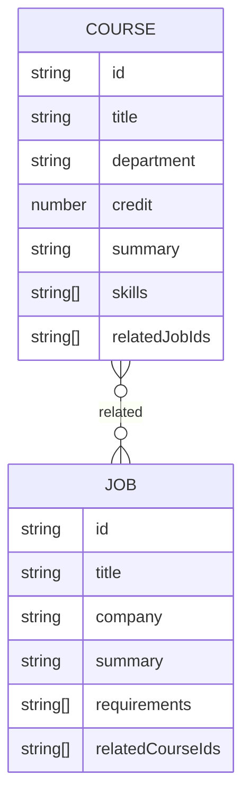
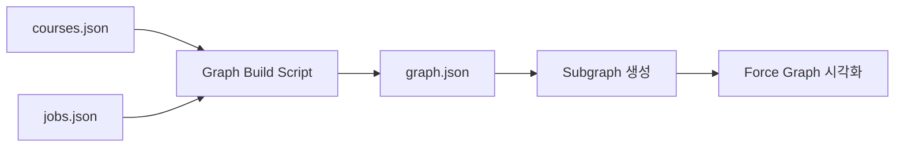

# Degree-folio

> 강의 선택을 취업 준비와 연결하는 교과·커리어 탐색 서비스

**2026 PNU 지역문제해결 에듀테크 해커톤**

Degree-folio는 대학 강의와 직무의 관계를 연결하여
학생이 **“이 강의를 들으면 어떤 직무 역량과 연결될 수 있는가?”**를 탐색할 수 있도록 만든 에듀테크 프로토타입입니다.

단순히 졸업 요건이나 시간표를 기준으로 강의를 선택하는 것을 넘어, 강의에서 학습하는 내용과 실제 직무에서 요구하는 역량을 함께 확인할 수 있도록 설계했습니다.

---

## 문제 정의

대학생은 수강신청 과정에서 강의명, 학점, 시간표 등의 정보는 쉽게 확인할 수 있지만 해당 강의가 자신의 진로와 어떻게 연결되는지는 직접 판단해야 합니다.

반대로 채용공고에는 요구 기술과 역량이 구체적으로 제시되어 있지만, 이를 대학에서 어떤 강의를 통해 준비할 수 있는지 찾기는 어렵습니다.

Degree-folio는 이 두 정보를 연결합니다.

```text
대학 강의
    ↓
학습 내용 · 기술 · 주제
    ↓
관련 직무 및 요구 역량
    ↓
커리어 관점의 수강 탐색
```

학생이 강의를 단순한 학점 이수가 아니라 **커리어를 구성하는 하나의 학습 경험**으로 바라볼 수 있도록 하는 것이 프로젝트의 목표입니다.

---

## 서비스 흐름


강의와 직무 어느 쪽에서 시작하더라도 서로 연결된 정보를 탐색할 수 있도록 양방향 구조로 구성했습니다.

---

## 주요 기능

### 강의 탐색

전공별 강의 목록을 확인하고 관심 있는 강의의 상세 정보를 탐색할 수 있습니다.

강의별로 다음 정보를 제공합니다.

* 강의 개요
* 학점 및 교과 구분
* 사용 도구 및 기술
* 학습 목표
* 핵심 학습 주제
* 예상 산출물
* 관련 채용공고

---

### 강의와 직무 연결

각 강의에는 해당 강의에서 학습하는 내용과 연관된 채용공고가 연결됩니다.

반대로 채용공고에서도 해당 직무를 준비하는 데 도움이 되는 강의를 확인할 수 있습니다.

```text
강의
 ├─ 학습 내용
 ├─ 사용 기술
 └─ 관련 직무 ─────────┐
                       │
                       ▼
                    채용공고
                       │
                       ├─ 주요 업무
                       ├─ 요구 역량
                       └─ 관련 강의
```

강의와 채용공고가 서로 동일한 관계를 참조하도록 데이터를 구성하고, 애플리케이션 실행 시 관계가 일치하는지 검증합니다.

---

### 관계 그래프

강의와 직무의 관계를 목록뿐 아니라 그래프 형태로 탐색할 수 있습니다.

* 강의 노드와 직무 노드를 서로 다른 형태로 구분
* 선택한 노드를 중심으로 관련 데이터 시각화
* 최대 2단계까지 연관 관계 탐색
* 그래프의 노드를 선택해 강의 또는 직무 상세 페이지로 이동
* Force Graph를 이용해 관계를 직관적으로 표현

예를 들어 강의를 중심으로 그래프를 열면 다음 관계를 확인할 수 있습니다.

```text
            관련 강의
               ▲
               │
강의 ─── 관련 직무 ─── 관련 강의
               │
               ▼
            관련 강의
```

이를 통해 하나의 강의가 어떤 직무와 연결되고, 다시 그 직무가 어떤 다른 강의와 연결되는지 탐색할 수 있습니다.

---

## 데이터 구조

Degree-folio에서는 강의와 채용공고를 서로 연결되는 두 종류의 노드로 다룹니다.



강의는 `relatedJobIds`, 채용공고는 `relatedCourseIds`를 통해 서로를 참조합니다.

애플리케이션에서 데이터를 읽을 때 양쪽 관계를 검증하여 한쪽에만 존재하는 연결이 생기지 않도록 관리합니다.

---

## 그래프 생성 구조

서비스에서 사용하는 그래프 전체를 화면 렌더링 시마다 계산하지 않고, 강의와 채용공고 데이터를 기반으로 그래프 데이터를 미리 생성합니다.



### 1. 전체 그래프 생성

`courses.json`과 `jobs.json`의 관계를 이용해 강의와 직무를 Node로, 두 데이터의 관계를 Edge로 변환합니다.

```bash
pnpm build:graph
```

생성된 그래프는 `src/data/graph.json`에 저장됩니다.

### 2. 필요한 관계만 추출

사용자가 선택한 강의 또는 직무를 중심으로 전체 그래프에서 최대 2단계까지의 관계만 추출합니다.

```text
강의 중심
강의 → 직무 → 강의

직무 중심
직무 → 강의 → 직무
```

그래프가 커지더라도 현재 탐색에 필요한 노드만 화면에 표시하도록 구성했습니다.

---

## 개발 과정에서의 선택

프로젝트 초기에는 채용공고를 LLM으로 분석하여 핵심 역량을 추출하고, 해당 역량과 관련된 강의를 추천하는 구조를 실험했습니다.

```text
채용공고
   ↓
LLM 역량 분석
   ↓
핵심 역량 추출
   ↓
관련 강의 추천
```

하지만 해커톤 환경에서는 제한된 개발 시간 안에 외부 AI API 호출, 응답 형식 검증, 추천 품질, 네트워크 상태까지 안정적으로 관리해야 했습니다.

최종 데모에서는 **추천 결과 자체보다 사용자가 강의와 직무의 관계를 탐색하는 경험을 완성하는 것**을 우선했습니다.

따라서 실행 시 AI API에 의존하는 대신 강의와 직무의 관계를 사전에 구성하고, 이를 기반으로 상세 페이지와 관계 그래프를 제공하도록 범위를 조정했습니다.

이를 통해 외부 API 상태와 관계없이 동일한 데이터로 안정적인 데모가 가능하도록 했습니다.

---

## 기술 스택

| 구분           | 기술                     | 활용                         |
| ------------ | ---------------------- | -------------------------- |
| Framework    | `Next.js`              | App Router 기반 페이지 및 동적 라우팅 |
| UI           | `React`                | 인터랙티브 UI 구성                |
| Language     | `TypeScript`           | 데이터 모델 및 컴포넌트 타입 관리        |
| Styling      | `Tailwind CSS`         | 서비스 UI 구성                  |
| Graph        | `react-force-graph-2d` | 강의·직무 관계 시각화               |
| Graph Layout | `d3-force`             | 노드 간 물리 기반 배치              |
| Data         | `JSON`                 | 강의·채용공고·그래프 데이터 관리         |

---

## 프로젝트 구조

```text
degreefolio/
├── src/
│   ├── app/
│   │   ├── courses/
│   │   │   └── [courseId]/       # 강의 상세
│   │   ├── jobs/
│   │   │   └── [jobId]/          # 채용공고 상세
│   │   ├── graph/
│   │   │   └── [type]/[id]/      # 관계 그래프
│   │   └── page.tsx              # 강의 목록
│   │
│   ├── components/
│   │   ├── GraphCanvas.tsx       # Force Graph
│   │   ├── GraphPanel.tsx
│   │   ├── Card.tsx
│   │   └── ...
│   │
│   ├── data/
│   │   ├── courses.json          # 강의 데이터
│   │   ├── jobs.json             # 채용공고 데이터
│   │   └── graph.json            # 생성된 그래프
│   │
│   └── lib/
│       ├── data.ts               # 데이터 변환 및 관계 검증
│       └── subgraph.ts           # 중심 노드 기반 부분 그래프 생성
│
└── scripts/
    └── buildGraph.mjs            # 전체 그래프 생성
```

---

## 실행 방법

### 요구 환경

* Node.js
* pnpm

### 저장소 복제

```bash
git clone https://github.com/sunnypark87/degreefolio.git
cd degreefolio
```

### 의존성 설치

```bash
pnpm install
```

### 개발 서버 실행

```bash
pnpm dev
```

브라우저에서 아래 주소로 접속합니다.

```text
http://localhost:3000
```

---

## 주요 명령어

```bash
# 개발 서버
pnpm dev

# 프로덕션 빌드
pnpm build

# 코드 검사
pnpm lint

# 강의-직무 관계 그래프 재생성
pnpm build:graph
```

---

## 데이터 안내

현재 채용공고 데이터는 해커톤 프로토타입의 서비스 흐름을 검증하기 위한 샘플 데이터입니다.

Degree-folio는 실제 서비스 환경에서는 대학 교과정보와 채용 데이터를 지속적으로 수집·갱신하고, 강의와 직무 사이의 관계를 보다 정교하게 분석하는 구조로 확장할 수 있습니다.

---

## 라이선스

This project is licensed under the MIT License.

